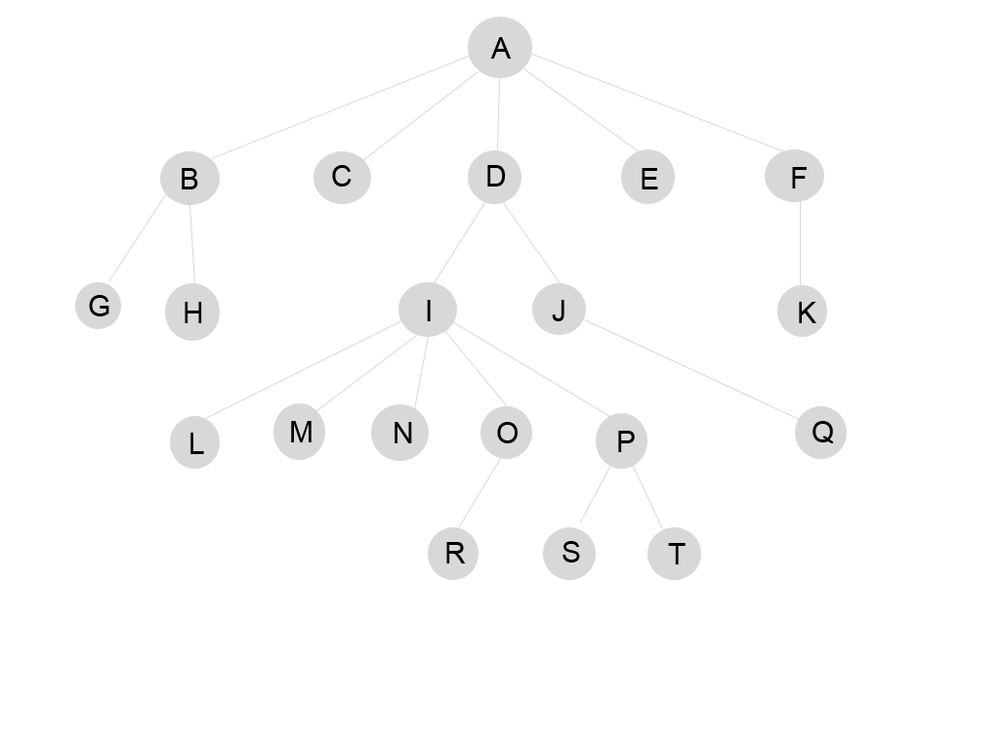

# Laravel MLM system

MLM website using Laravel

## Installation
```bash
composer install
cp .env.example .env
php artisan key:generate
php artisan migrate --seed
php artisan serve

http://localhost:8000
```

## IP Geolocation API
IP Geolocation API is a free real-time IP to [Geolocation](https://ipgeolocationapi.com/) JSON API with detailed countries data integration.